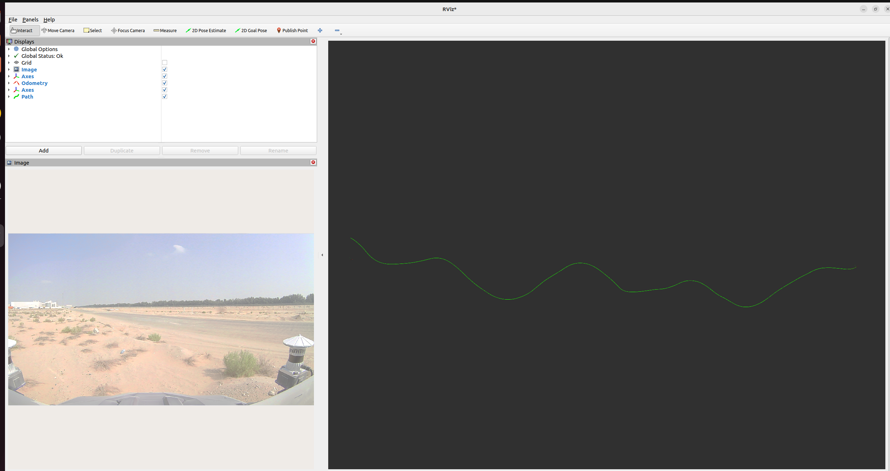
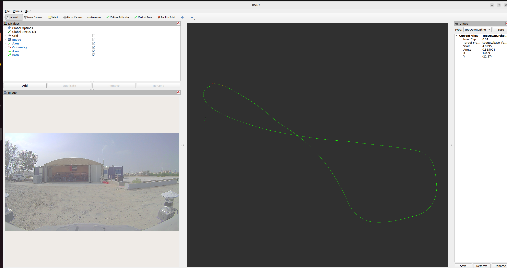
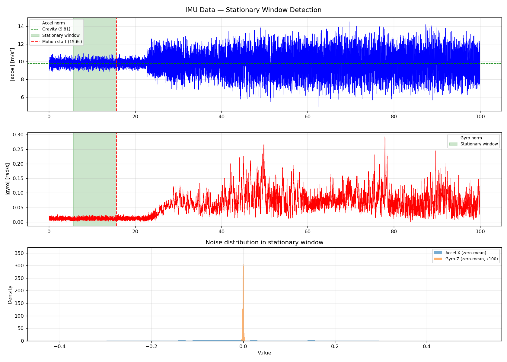

# tbuggy Visual Localization — Running Results Documentation

---

## Utility Scripts

| Script | Purpose | Run |
|--------|---------|-----|
| `extract_tf_and_imu.py` | Reads `/tf_static` from db3, chains TF transforms to compute `T_imu_cam`, prints IMU stats | `python3 utils/extract_tf_and_imu.py <path/to/.db3>` |
| `imu_noise_analysis.py` | Detects stationary window, computes noise_density and random_walk, saves plot | `python3 utils/imu_noise_analysis.py <path/to/.db3>` |
| `extract_gt_csv.py` | Converts `/tbuggy/odom` from bag → EuRoC ASL CSV for OpenVINS `pathgt` visualization | `python3 utils/extract_gt_csv.py <path/to/.db3> <out.csv>` |
| `evaluate_trajectory.py` | Converts OpenVINS estimate + GT to TUM format, runs `evo_ape`/`evo_rpe` | `python3 utils/evaluate_trajectory.py --est <est.txt> --gt <gt.csv> --out <dir>` |
| `plot_trajectory_comparison.py` | Umeyama Sim3 alignment, ATE computation, trajectory overlay + ATE-over-time plots | `python3 utils/plot_trajectory_comparison.py --est <est_tum.txt> --gt <gt_tum.txt> --out <dir>` |

All scripts read `.db3` directly via `sqlite3` + `rosbags` typestore (no ROS2 node required).

---

## Bag Overview

| Sequence | Duration | Camera frames | IMU msgs | Odom msgs |
|----------|----------|---------------|----------|-----------|
| log_01   | 549.8 s  | 16,473        | 54,969   | 21,991    |
| log_02   | 336.7 s  | 10,091        | 33,648   | 13,467    |

## Message Rates

| Topic | Rate (Hz) |
|-------|-----------|
| `/tbuggy/camera_front/image_raw` | ~28 |
| `/tbuggy/imu_ins` | ~100 |
| `/tbuggy/odom` | ~40 |

Note: Camera delivers ~28 Hz (not 30) — slight frame drops typical of field data; accounted for in `track_frequency`.

## Camera Intrinsics (from `/tbuggy/camera_front/camera_info`)

- **Frame ID:** `tbuggy/camera_front`
- **Resolution:** 1920 × 1080
- **Distortion model:** `plumb_bob` → maps to `radtan` in OpenVINS

| Parameter | Value |
|-----------|-------|
| fx | 1033.372 |
| fy | 1032.308 |
| cx | 886.065  |
| cy | 448.679  |
| k1 | -0.35074 |
| k2 |  0.13006 |
| p1 | -0.00064 |
| p2 |  0.00111 |
| k3 |  0.0 (ignored by OpenVINS radtan) |

## Topics Available

| Topic | Type | Description |
|-------|------|-------------|
| `/tbuggy/camera_front/image_raw` | `sensor_msgs/Image` | Raw front camera |
| `/tbuggy/camera_front/camera_info` | `sensor_msgs/CameraInfo` | Camera intrinsics |
| `/tbuggy/imu_ins` | `sensor_msgs/Imu` | IMU data |
| `/tbuggy/odom` | `nav_msgs/Odometry` | Ground truth (x, y, yaw) |
| `/tbuggy/fix` | `sensor_msgs/NavSatFix` | GPS fix |
| `/tbuggy/relative_odom` | `nav_msgs/Odometry` | Relative odometry |
| `/tbuggy/navsat/odometry` | `nav_msgs/Odometry` | GPS-derived odometry |
| `/tf`, `/tf_static` | `tf2_msgs/TFMessage` | Transform tree |

---

## Ground Truth Trajectories

### log_01 — Full Trajectory



Roughly linear path with gentle lateral undulations. Sandy flat desert terrain, largely featureless far field.

### log_02 — Full Trajectory



Closed-loop oval. Vehicle returns near start — useful for evaluating drift. Scene has a building/hangar providing richer features.

### log_02 — Start Frame


Vehicle stationary in front of hangar. Camera provides good near-field texture (building facade, vehicles).

---

## Camera-IMU Extrinsics (from `/tf_static` TF chain)

**IMU frame:** `tbuggy/sensor_wgs84` | **Camera frame:** `tbuggy/camera_front`

Transform chain:
```
base_footprint → os1/os_sensor → os2/os_sensor → camera_front   (camera path)
base_footprint → sensor_wgs84                                     (IMU path)
T_imu_cam = inv(T_bf_imu) @ T_bf_cam
```

**T_imu_cam (4×4):**
```
[-0.00399597,  0.03610835,  0.99933989,  1.14080141]
[-0.99991243,  0.01246384, -0.00444861, -0.19920164]
[-0.01261624, -0.99927015,  0.03605539,  1.64578202]
[ 0.00000000,  0.00000000,  0.00000000,  1.00000000]
```

Camera origin in IMU frame: `[1.14, -0.20, 1.65] m` — camera is ~1.65m above and 1.14m forward of IMU.
Camera +Z (optical axis) in IMU frame: `[0.999, -0.004, 0.036]` → faces forward along robot +X ✓

---

## IMU Noise Analysis



Stationary window: index 562–1562, **t = 5.6s to 15.6s** (1000 samples at 100 Hz). Vehicle at idle before motion.

| Axis | Accel std [m/s²] | Gyro std [rad/s] |
|------|-----------------|-----------------|
| X    | 0.171           | 8.36e-3         |
| Y    | 0.188           | 5.11e-3         |
| Z    | 0.371           | 1.18e-3         |

Gravity norm: **9.82 m/s²** ✓. High accel-Z std = engine idling vibration, not a data issue.

### IMU Parameter Computation

**`noise_density = std(axis) / sqrt(sample_rate)`** — continuous-time white noise spectral density.
**`random_walk = noise_density × 0.1`** — heuristic bias drift rate (Allan Variance unavailable).

| Parameter | Measured | Final (×2) | How |
|-----------|----------|------------|-----|
| `accelerometer_noise_density` | 3.7e-2 m/s²/√Hz | **7.4e-2** | max axis std / √100, ×2 safety |
| `accelerometer_random_walk`   | 3.7e-3 m/s³/√Hz | **7.4e-3** | ×0.1 of noise_density |
| `gyroscope_noise_density`     | 8.4e-4 rad/s/√Hz | **1.7e-3** | max axis std / √100, ×2 safety |
| `gyroscope_random_walk`       | 8.4e-5 rad/s²/√Hz | **1.7e-4** | ×0.1 of noise_density |

**Why 2× safety margin for this desert scene:**
1. **Stationary ≠ moving noise** — idle measurement misses wheel/terrain vibration (1.5–3× higher during motion)
2. **Featureless desert → IMU dead-reckoning gaps** — sparse feature tracking means longer IMU-only propagation; conservative noise prevents over-confident states
3. **Under-estimated noise → filter divergence** — too-tight noise compresses the uncertainty ellipsoid; bad visual updates from featureless frames cause catastrophic divergence
4. **High accel-Z at idle (0.37 m/s²)** — engine vibration will increase further during motion; 7.4e-2 is a realistic in-motion estimate

Revert to 1× if: system initializes but loses tracking within seconds (noise over-estimated).

---

## OpenVINS Config Files

Located in `colcon_ws_tii/src/open_vins/config/tbuggy/`:

### `kalibr_imu_chain.yaml`
IMU sensor model for `/tbuggy/imu_ins` at 100 Hz. Noise values from stationary window ×2 safety margin.

### `kalibr_imucam_chain.yaml`
Camera model + intrinsics + `T_imu_cam` extrinsic. Distortion: `radtan` (= ROS `plumb_bob`). Topic: `/tbuggy/camera_front/image_raw`.

### `estimator_config.yaml`
Main VIO estimator. Key settings:
- `max_cameras: 1`, `use_stereo: false` — monocular
- `init_dyn_use: true` — vehicle may be moving at bag start
- `try_zupt: true`, `zupt_max_velocity: 0.5` — zero-velocity updates on stops
- `histogram_method: CLAHE` — outdoor variable lighting
- `downsample_cameras: true` — 1920×1080 → 960×540 for faster KLT
- `track_frequency: 28.0` — matches observed camera rate
- `calib_cam_extrinsics/intrinsics/timeoffset: true` — online calibration refinement
- `feat_rep_slam: ANCHORED_MSCKF_INVERSE_DEPTH` — better monocular scale handling

---

## OpenVINS Launch — Commands

### Build (memory-safe, use when code changes)
```bash
cd /home/udit/codes/tii_assignment/colcon_ws_tii
MAKEFLAGS="-j2" colcon build --symlink-install \
  --executor sequential \
  --parallel-workers 1
```

### Terminal 1 — Launch OpenVINS (log_01)
```bash
cd /home/udit/codes/tii_assignment/colcon_ws_tii
source install/setup.bash
ros2 launch ov_msckf subscribe.launch.py \
  config_path:=$(pwd)/src/open_vins/config/tbuggy/estimator_config.yaml \
  max_cameras:=1 \
  use_stereo:=false \
  save_total_state:=true \
  filepath_est:=/home/udit/codes/tii_assignment/colcon_ws_tii/utils/results/ov_estimate_log01.txt \
  filepath_std:=/home/udit/codes/tii_assignment/colcon_ws_tii/utils/results/ov_estimate_std_log01.txt \
  path_gt:=/home/udit/codes/tii_assignment/colcon_ws_tii/utils/results/gt_log01.csv \
  rviz_enable:=true
```

### Terminal 2 — Play bag
```bash
ros2 bag play /home/udit/data/log_01_ros2 --clock --rate 0.5
```

For log_02, replace `log01` with `log02` in both `filepath_est`, `path_gt`, and the bag path.

### Generate GT CSV (one-time, before launching)
```bash
python3 utils/extract_gt_csv.py \
  /home/udit/data/log_01_ros2/log_01_ros2_0.db3 \
  results/gt_log01.csv

python3 utils/extract_gt_csv.py \
  /home/udit/data/log_02_ros2/log_02_ros2_0.db3 \
  results/gt_log02.csv
```

### Evaluate trajectory (after run completes)
```bash
python3 utils/evaluate_trajectory.py \
  --est results/ov_estimate_log01.txt \
  --gt  results/gt_log01.csv \
  --out results/

python3 utils/plot_trajectory_comparison.py \
  --est results/est_tum.txt \
  --gt  results/gt_tum.txt \
  --out results/
```

---

## Launch File Modifications — `subscribe.launch.py`

The upstream `subscribe.launch.py` was extended to forward output file paths and the GT CSV path as ROS node parameters (required by `ROS2Visualizer` but absent from the original launch file):

| Argument added | Purpose |
|----------------|---------|
| `filepath_est`, `filepath_std` | Paths to save VIO estimated state and std-dev |
| `path_gt` | Path to EuRoC ASL GT CSV for `pathgt` RViz visualization |

`path_gt` requires a pre-generated CSV (via `extract_gt_csv.py`) — OpenVINS does not read `/tbuggy/odom` from the bag directly. In RViz the GT and VIO paths appear in different frames (expected — OpenVINS initialises its own arbitrary `global` frame); quantitative alignment is done offline with Sim3 Umeyama in `plot_trajectory_comparison.py`.

---

## log_01 Evaluation Results (partial run, ~7924/16473 frames)

