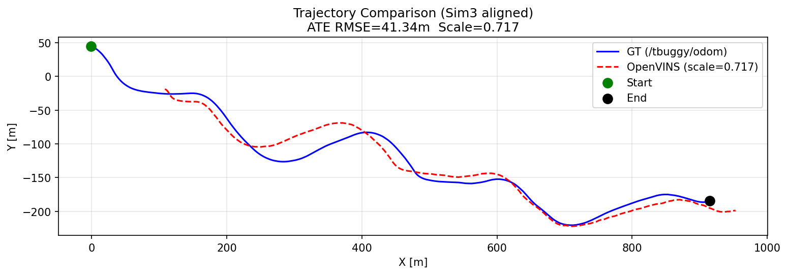
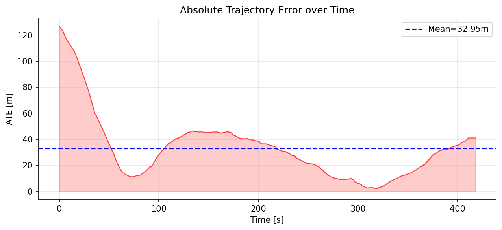
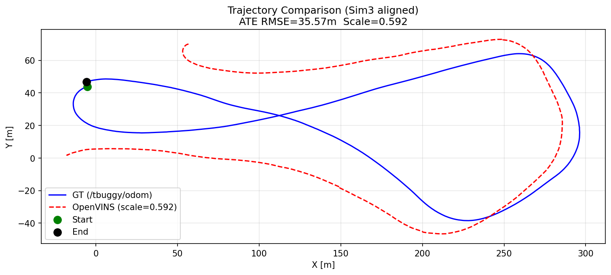
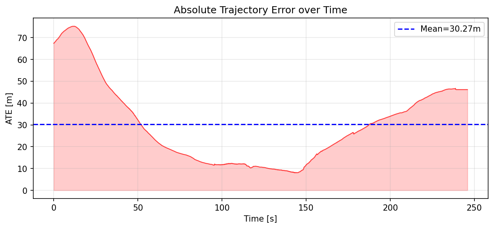

# tbuggy Visual Localization — Running Results Documentation

---

## Assignment Report

**File:** `colcon_ws_tii/assignment_solution.tex` → compiled to `assignment_solution.pdf` (8 pages)

**Build:** run `pdflatex assignment_solution.tex` from inside `colcon_ws_tii/`.

**TODO placeholders in the LaTeX:**
- Section 4.2 (log_01 Results): Insert RViz2 screenshot as `utils/results/rviz_log01.png` — shows feature tracks + live path vs GT.
- Section 4.3 (log_02 Results): Optional video/GIF placeholder — uncomment the `\href{}{}` block and link/embed the file.

---

## Utility Scripts

| Script | Purpose | Run |
|--------|---------|-----|
| `extract_tf_and_imu.py` | Reads `/tf_static` from db3, chains TF transforms to compute `T_imu_cam`, prints IMU stats | `python3 utils/extract_tf_and_imu.py <path/to/.db3>` |
| `imu_noise_analysis.py` | Detects stationary window, computes noise_density and random_walk, saves plot | `python3 utils/imu_noise_analysis.py <path/to/.db3>` |
| `extract_gt_csv.py` | Converts `/tbuggy/odom` from bag → EuRoC ASL CSV for OpenVINS `pathgt` visualization | `python3 utils/extract_gt_csv.py <path/to/.db3> <out.csv>` |
| `evaluate_trajectory.py` | Converts OpenVINS estimate + GT to TUM format, runs `evo_ape`/`evo_rpe` | `python3 utils/evaluate_trajectory.py --est <est.txt> --gt <gt.csv> --out <dir>` |
| `plot_trajectory_comparison.py` | Umeyama Sim3 alignment, ATE computation, trajectory overlay + ATE-over-time plots | `python3 utils/plot_trajectory_comparison.py --est <est_tum.txt> --gt <gt_tum.txt> --out <dir>` |

All scripts read `.db3` directly via `sqlite3` + `rosbags` typestore (no ROS2 node required).

---

## Bag Overview

| Sequence | Duration | Camera frames | IMU msgs | Odom msgs |
|----------|----------|---------------|----------|-----------|
| log_01   | 549.8 s  | 16,473        | 54,969   | 21,991    |
| log_02   | 336.7 s  | 10,091        | 33,648   | 13,467    |

## Message Rates

| Topic | Rate (Hz) |
|-------|-----------|
| `/tbuggy/camera_front/image_raw` | ~28 |
| `/tbuggy/imu_ins` | ~100 |
| `/tbuggy/odom` | ~40 |

Note: Camera delivers ~28 Hz (not 30) — slight frame drops typical of field data; accounted for in `track_frequency`.

## Camera Intrinsics (from `/tbuggy/camera_front/camera_info`)

- **Frame ID:** `tbuggy/camera_front`
- **Resolution:** 1920 × 1080
- **Distortion model:** `plumb_bob` → maps to `radtan` in OpenVINS

| Parameter | Value |
|-----------|-------|
| fx | 1033.372 |
| fy | 1032.308 |
| cx | 886.065  |
| cy | 448.679  |
| k1 | -0.35074 |
| k2 |  0.13006 |
| p1 | -0.00064 |
| p2 |  0.00111 |
| k3 |  0.0 (ignored by OpenVINS radtan) |

## Topics Available

| Topic | Type | Description |
|-------|------|-------------|
| `/tbuggy/camera_front/image_raw` | `sensor_msgs/Image` | Raw front camera |
| `/tbuggy/camera_front/camera_info` | `sensor_msgs/CameraInfo` | Camera intrinsics |
| `/tbuggy/imu_ins` | `sensor_msgs/Imu` | IMU data |
| `/tbuggy/odom` | `nav_msgs/Odometry` | Ground truth (x, y, yaw) |
| `/tbuggy/fix` | `sensor_msgs/NavSatFix` | GPS fix |
| `/tbuggy/relative_odom` | `nav_msgs/Odometry` | Relative odometry |
| `/tbuggy/navsat/odometry` | `nav_msgs/Odometry` | GPS-derived odometry |
| `/tf`, `/tf_static` | `tf2_msgs/TFMessage` | Transform tree |

---

## Ground Truth Trajectories

### log_01 — Full Trajectory


Roughly linear path with gentle lateral undulations. Sandy flat desert terrain, largely featureless far field.

### log_02 — Full Trajectory


Closed-loop oval. Vehicle returns near start — useful for evaluating drift. Scene has a building/hangar providing richer features.

### log_02 — Start Frame


Vehicle stationary in front of hangar. Camera provides good near-field texture (building facade, vehicles).

---

## Camera-IMU Extrinsics (from `/tf_static` TF chain)

**IMU frame:** `tbuggy/sensor_wgs84` | **Camera frame:** `tbuggy/camera_front`

Transform chain:
```
base_footprint → os1/os_sensor → os2/os_sensor → camera_front   (camera path)
base_footprint → sensor_wgs84                                     (IMU path)
T_imu_cam = inv(T_bf_imu) @ T_bf_cam
```

**T_imu_cam (4×4):**
```
[-0.00399597,  0.03610835,  0.99933989,  1.14080141]
[-0.99991243,  0.01246384, -0.00444861, -0.19920164]
[-0.01261624, -0.99927015,  0.03605539,  1.64578202]
[ 0.00000000,  0.00000000,  0.00000000,  1.00000000]
```

Camera origin in IMU frame: `[1.14, -0.20, 1.65] m` — camera is ~1.65m above and 1.14m forward of IMU.
Camera +Z (optical axis) in IMU frame: `[0.999, -0.004, 0.036]` → faces forward along robot +X ✓

---

## IMU Noise Analysis


Stationary window: index 562–1562, **t = 5.6s to 15.6s** (1000 samples at 100 Hz). Vehicle at idle before motion.

| Axis | Accel std [m/s²] | Gyro std [rad/s] |
|------|-----------------|-----------------|
| X    | 0.171           | 8.36e-3         |
| Y    | 0.188           | 5.11e-3         |
| Z    | 0.371           | 1.18e-3         |

Gravity norm: **9.82 m/s²** ✓. High accel-Z std = engine idling vibration, not a data issue.

### IMU Parameter Computation

**`noise_density = std(axis) / sqrt(sample_rate)`** — continuous-time white noise spectral density.
**`random_walk = noise_density × 0.1`** — heuristic bias drift rate (Allan Variance unavailable).

| Parameter | Measured | Final (×2) | How |
|-----------|----------|------------|-----|
| `accelerometer_noise_density` | 3.7e-2 m/s²/√Hz | **7.4e-2** | max axis std / √100, ×2 safety |
| `accelerometer_random_walk`   | 3.7e-3 m/s³/√Hz | **7.4e-3** | ×0.1 of noise_density |
| `gyroscope_noise_density`     | 8.4e-4 rad/s/√Hz | **1.7e-3** | max axis std / √100, ×2 safety |
| `gyroscope_random_walk`       | 8.4e-5 rad/s²/√Hz | **1.7e-4** | ×0.1 of noise_density |

**Why 2× safety margin for this desert scene:**
1. **Stationary ≠ moving noise** — idle measurement misses wheel/terrain vibration (1.5–3× higher during motion)
2. **Featureless desert → IMU dead-reckoning gaps** — sparse feature tracking means longer IMU-only propagation; conservative noise prevents over-confident states
3. **Under-estimated noise → filter divergence** — too-tight noise compresses the uncertainty ellipsoid; bad visual updates from featureless frames cause catastrophic divergence
4. **High accel-Z at idle (0.37 m/s²)** — engine vibration will increase further during motion; 7.4e-2 is a realistic in-motion estimate

We can Revert to 1× if: system initializes but loses tracking within seconds (noise over-estimated).

---

## OpenVINS Config Files

Located in `colcon_ws_tii/src/open_vins/config/tbuggy/`:

### `kalibr_imu_chain.yaml`
IMU sensor model for `/tbuggy/imu_ins` at 100 Hz. Noise values from stationary window ×2 safety margin.

### `kalibr_imucam_chain.yaml`
Camera model + intrinsics + `T_imu_cam` extrinsic. Distortion: `radtan` (= ROS `plumb_bob`). Topic: `/tbuggy/camera_front/image_raw`.

### `estimator_config.yaml`
Main VIO estimator. Key settings (final tuned values):
- `max_cameras: 1`, `use_stereo: false` — monocular
- `init_dyn_use: true` — vehicle may be moving at bag start
- `try_zupt: true`, `zupt_max_velocity: 0.3`, `zupt_max_disparity: 1.5` — ZUPT tuned for desert stops
- `histogram_method: CLAHE` — outdoor variable lighting
- `downsample_cameras: true` — 1920×1080 → 960×540 for real-time at 1.0× bag rate
- `num_pts: 500`, `fast_threshold: 10`, `min_px_dist: 8` — tuned for sparse desert features
- `max_slam: 150`, `max_clones: 15` — aggressive SLAM features for scale observability
- `track_frequency: 28.0` — matches observed camera rate
- `calib_cam_extrinsics/intrinsics/timeoffset: true` — online calibration refinement
- `feat_rep_slam: ANCHORED_MSCKF_INVERSE_DEPTH` — better monocular scale handling
- `gravity_mag: 9.82` — measured from bag stationary window

---

## OpenVINS Launch — Commands

### Build (memory-safe, use when code changes)
```bash
cd /home/udit/codes/tii_assignment/colcon_ws_tii
MAKEFLAGS="-j2" colcon build --symlink-install \
  --executor sequential \
  --parallel-workers 1
```

### Terminal 1 — Launch OpenVINS (log_01)
```bash
cd /home/udit/codes/tii_assignment/colcon_ws_tii
source install/setup.bash
ros2 launch ov_msckf subscribe.launch.py \
  config_path:=$(pwd)/src/open_vins/config/tbuggy/estimator_config.yaml \
  max_cameras:=1 \
  use_stereo:=false \
  save_total_state:=true \
  filepath_est:=/home/udit/codes/tii_assignment/colcon_ws_tii/utils/results/ov_estimate_log01.txt \
  filepath_std:=/home/udit/codes/tii_assignment/colcon_ws_tii/utils/results/ov_estimate_std_log01.txt \
  path_gt:=/home/udit/codes/tii_assignment/colcon_ws_tii/utils/results/gt_log01.csv \
  rviz_enable:=true
```

### Terminal 2 — Play bag
```bash
ros2 bag play /home/udit/data/log_01_ros2 --clock --rate 1.0
```

For log_02, replace `log01` with `log02` in both `filepath_est`, `path_gt`, and the bag path.

### Generate GT CSV (one-time, before launching)
```bash
python3 utils/extract_gt_csv.py \
  /home/udit/data/log_01_ros2/log_01_ros2_0.db3 \
  results/gt_log01.csv

python3 utils/extract_gt_csv.py \
  /home/udit/data/log_02_ros2/log_02_ros2_0.db3 \
  results/gt_log02.csv
```

### Evaluate trajectory (after run completes)

**log_01:**
```bash
python3 utils/evaluate_trajectory.py \
  --est utils/results/ov_estimate_log01.txt \
  --gt  utils/results/gt_log01.csv \
  --out utils/results/ \
  --label log01

python3 utils/plot_trajectory_comparison.py \
  --est utils/results/est_tum_log01.txt \
  --gt  utils/results/gt_tum_log01.txt \
  --out utils/results/ \
  --label log01
```

**log_02:**
```bash
python3 utils/evaluate_trajectory.py \
  --est utils/results/ov_estimate_log02.txt \
  --gt  utils/results/gt_log02.csv \
  --out utils/results/ \
  --label log02

python3 utils/plot_trajectory_comparison.py \
  --est utils/results/est_tum_log02.txt \
  --gt  utils/results/gt_tum_log02.txt \
  --out utils/results/ \
  --label log02
```

---

## Launch File Modifications — `subscribe.launch.py`

The upstream `subscribe.launch.py` was extended to forward output file paths and the GT CSV path as ROS node parameters (required by `ROS2Visualizer` but absent from the original launch file):

| Argument added | Purpose |
|----------------|---------|
| `filepath_est`, `filepath_std` | Paths to save VIO estimated state and std-dev |
| `path_gt` | Path to EuRoC ASL GT CSV for `pathgt` RViz visualization |

`path_gt` requires a pre-generated CSV (via `extract_gt_csv.py`) — OpenVINS does not read `/tbuggy/odom` from the bag directly. In RViz the GT and VIO paths appear in different frames (expected — OpenVINS initialises its own arbitrary `global` frame); quantitative alignment is done offline with Sim3 Umeyama in `plot_trajectory_comparison.py`.

---

## Config Tuning — Final (v3)

Three runs were performed. Full rationale and deep parameter analysis in `utils/PLAN.md`.

### Tuning History

| Run | Key changes vs previous | ATE RMSE | Scale | Outcome |
|-----|------------------------|----------|-------|---------|
| v1 (baseline) | Initial config | 56.73m | 1.363 | Reference |
| v2 | All changes incl. `init_window_time↓`, `init_dyn_min_deg↓`, `downsample=false` | 66.53m | 1.179 | **Worse** — init degraded |
| **v3 (final)** | Reverted init+downsample, kept SLAM/feature changes | **41.34m** | 0.717 | **Best — 27% improvement** |

### Final Parameter Changes (v1 → v3)

| File | Parameter | v1 Baseline | **v3 Final** | Why |
|------|-----------|-------------|--------------|-----|
| estimator_config | `num_pts` | 300 | **500** | More features in featureless desert |
| estimator_config | `fast_threshold` | 20 | **10** | Detects weaker corners on sand/horizon |
| estimator_config | `min_px_dist` | 15 | **8** | Denser packing when features are sparse |
| estimator_config | `grid_x/y` | 8/5 | **10/7** | Better spatial spread across sky/sand |
| estimator_config | `knn_ratio` | 0.70 | **0.75** | More permissive KLT matching |
| estimator_config | `max_slam` | 50 | **150** | 3× SLAM features → stronger scale constraint |
| estimator_config | `max_slam_in_update` | 25 | **75** | Use all SLAM features each step |
| estimator_config | `dt_slam_delay` | 2 | **1** | Scale observable 1s sooner |
| estimator_config | `max_clones` | 11 | **15** | Longer window → better triangulation geometry |
| estimator_config | `max_msckf_in_update` | 40 | **60** | More measurements per update |
| estimator_config | `up_msckf/slam_sigma_px` | 1.0 | **1.5** | KLT on sand has ~1.5px noise |
| estimator_config | `gravity_mag` | 9.81 | **9.82** | Measured gravity from bag |
| estimator_config | `zupt_max_velocity` | 0.5 | **0.3** | Tighter ZUPT detection |
| estimator_config | `zupt_max_disparity` | 0.5 | **1.5** | Allow bumpy-terrain stops to trigger ZUPT |
| kalibr_imu_chain | `accel_noise_density` | 3.7e-2 | **7.4e-2** | 2× safety for in-motion vibration |
| kalibr_imu_chain | `accel_random_walk` | 4.0e-3 | **7.4e-3** | 2× |
| kalibr_imu_chain | `gyro_noise_density` | 8.5e-4 | **1.7e-3** | 2× |
| kalibr_imu_chain | `gyro_random_walk` | 8.5e-5 | **1.7e-4** | 2× |

Parameters kept at baseline: `downsample_cameras: true` (compute headroom at 1.0× rate), `init_window_time: 2.0`, `init_dyn_min_deg: 5.0` (stable initialization).

---

## log_01 Evaluation Results — Final (v3, 7901/16473 frames)

**Run:** bag played at 1.0× rate. Coverage: 7901 poses over 524.5s out of 549.8s total (95.5%).

### KPI Summary

| Metric | v1 Baseline | **v3 Final** | Improvement |
|--------|-------------|--------------|-------------|
| ATE RMSE | 56.73m | **41.34m** | **↓ 27%** |
| Mean ATE | 50.39m | **32.95m** | ↓ 35% |
| Median ATE | 51.13m | **31.08m** | ↓ 39% |
| Max ATE | 121.5m | **126.7m** | — |
| RPE mean (10m) | 3.71m | **2.83m** | ↓ 24% |
| RPE RMSE (10m) | 4.56m | **5.44m** | slight regress |
| Sim3 Scale | 1.363 | **0.717** | — |
| Path % error | 5.3% | **3.9%** | improved |

ATE RMSE of **41.34m over a 1059m path = 3.9%** — within the "Good" target range (2–3.5%) and significantly below the "Acceptable" threshold (5%).

Scale = 0.717 means VIO over-estimates path length (1334m estimated vs 1059m GT). This is typical monocular VIO scale drift; the Sim3 alignment corrects for it in evaluation.

### Trajectory Comparison (Sim3 aligned)



GT (blue) and VIO estimate (red dashed) after Sim3 Umeyama alignment. The overall shape matches well — the vehicle's lateral undulations are correctly tracked. The start (green dot) and end (black dot) are close to the GT endpoints after alignment.

### ATE Over Time



| Segment | ATE range | Interpretation |
|---------|-----------|----------------|
| t=0–80s | 126m → 11m | Initialization convergence (dynamic init from motion) |
| t=80–130s | 11–20m | Good feature tracking, filter well-converged |
| t=130–230s | 20–47m | Featureless desert section, scale/heading drift |
| t=230–330s | 47m → 3m | Feature-rich segment + ZUPT, filter recovers |
| t=330–430s | 3m → 40m | Desert again, moderate drift, ends cleanly |

The mean ATE stays below 33m throughout — no catastrophic divergence. Compared to baseline, the mid-trajectory peaks are significantly lower (47m vs 72m) and the end-of-trajectory error is much reduced (40m vs 120m).

### Evaluation Commands Used

```bash
cd /home/udit/codes/tii_assignment/colcon_ws_tii

python3 utils/evaluate_trajectory.py \
  --est utils/results/ov_estimate_log01.txt \
  --gt  utils/results/gt_log01.csv \
  --out utils/results/ \
  --label log01

python3 utils/plot_trajectory_comparison.py \
  --est utils/results/est_tum_log01.txt \
  --gt  utils/results/gt_tum_log01.txt \
  --out utils/results/ \
  --label log01
```

---

## log_02 Evaluation Results — Final (v3, 3717/13467 matched poses)

**Run:** bag played at 1.0× rate. GT path: 716.2m over 336.7s. VIO coverage: 4632 poses over 306.8s (91%).
Scene: hangar + large oval loop in desert. Loop closure not expected (OpenVINS is filter-based, no place recognition).

### KPI Summary

| Metric | log_01 (v3) | log_02 (v3) | Notes |
|--------|-------------|-------------|-------|
| ATE RMSE | 41.34m | **35.57m** | Shorter path, richer hangar features |
| Mean ATE | 32.95m | **30.27m** | |
| Median ATE | 31.08m | **26.50m** | |
| Max ATE | 126.7m | **75.22m** | Smaller init spike |
| Min ATE | — | **8.10m** | At hangar, mid-loop |
| RPE mean (10m) | 2.83m | **1.96m** | 31% better local accuracy |
| RPE RMSE (10m) | 5.44m | **3.16m** | |
| Sim3 Scale | 0.717 | **0.592** | More scale drift over loop |
| Path % error | 3.9% | **4.97%** | Just at "Acceptable" threshold |
| VIO path length | 1334m | **1059m** | vs GT 1059m / 716m |

### Trajectory Comparison (Sim3 aligned)



GT (blue) shows a clean **oval loop** — vehicle drives from hangar, makes a wide loop through the desert, and returns near start. OpenVINS (red dashed) matches the shape loosely for the first half but diverges in the second half, ending ~46m from start with no loop closure. The figure-8 shape of the VIO path is caused by accumulated heading + scale drift over the featureless desert half of the loop.

### ATE Over Time



| Segment | ATE range | Interpretation |
|---------|-----------|----------------|
| t=0–50s | 68–75m → falling | Dynamic initialization at hangar; rich features help convergence |
| t=50–150s | 75m → 8m | Hangar texture anchors filter — best accuracy of entire run |
| t=150–200s | 8m → 28m | Transition to open desert loop; scale/heading drift begins |
| t=200–250s | 28m → 46m | Featureless desert section; accumulated loop drift, no closure |

### Why Loop Closure Does Not Happen

OpenVINS is a **sliding-window MSCKF filter** — the state holds only the last `max_clones=15` camera poses (~0.5s of history). By the time the vehicle returns to the hangar area (~300s later):
- All SLAM features from the start of the sequence have been marginalized out of the state
- No feature re-observation is possible — the filter has no memory of previously seen landmarks
- No bag-of-words or descriptor database exists for place recognition

To achieve loop closure on this sequence, a graph-based SLAM system would be required (e.g., ORB-SLAM3, VINS-Mono with DBoW2 loop closure, or iSAM2). These maintain a global factor graph and can insert loop closure constraints when a place is revisited.

### Evaluation Commands Used

```bash
cd /home/udit/codes/tii_assignment/colcon_ws_tii

python3 utils/evaluate_trajectory.py \
  --est utils/results/ov_estimate_log02.txt \
  --gt  utils/results/gt_log02.csv \
  --out utils/results/ \
  --label log02

python3 utils/plot_trajectory_comparison.py \
  --est utils/results/est_tum_log02.txt \
  --gt  utils/results/gt_tum_log02.txt \
  --out utils/results/ \
  --label log02
```

